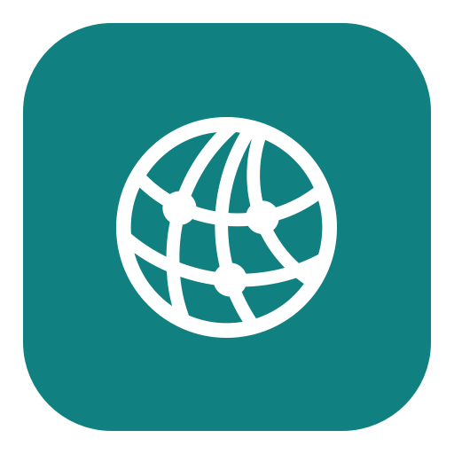
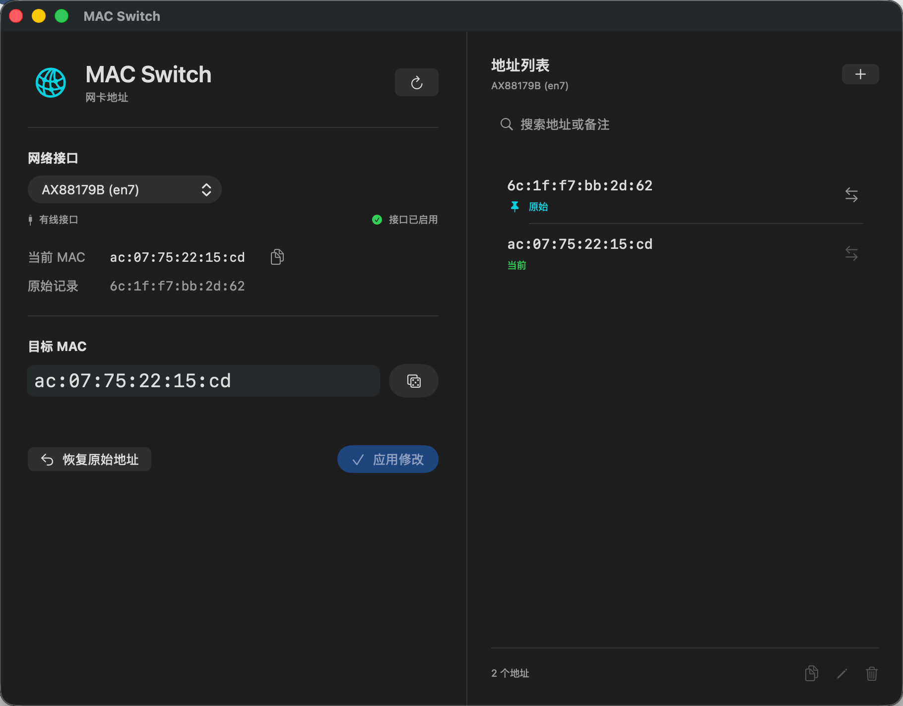

<p align="center">
  
</p>

<h1 align="center">MAC Switch</h1>

<p align="center">原生 macOS MAC 地址修改工具。</p>

<p align="center">
  
</p>

## 下载安装

从 [GitHub Releases](https://github.com/savvym/mac-switch/releases) 下载 DMG，打开后将 **MAC Switch** 拖入 **Applications**。

支持 macOS 13 及以上版本，兼容 Apple Silicon 和 Intel。

> 当前发行包尚未进行 Developer ID 签名及公证，首次打开可能出现 macOS 安全提示。

## 功能

- Wi-Fi 与有线网卡 MAC 地址管理
- 自定义地址与随机生成
- 每设备独立地址列表，支持备注、搜索和一键切换
- 自动记录历史，保留并恢复原始地址

## 使用

选择网卡，输入目标 MAC 或从列表中选择地址，确认修改并完成系统授权。

## 注意事项

- 改址支持取决于网卡及驱动。Wi-Fi 改址失败时，可尝试“重启 Wi-Fi 后修改”。
- 修改可能导致断网，重启或重新插拔后地址可能恢复。避免与同一网络内其他设备使用相同地址。
- “原始”指首次记录的地址，不一定是出厂 MAC。

## 源码构建

需要 Xcode Command Line Tools：

```bash
bash build.sh
```

## 本地打包 DMG

另需 Python 3.11+：

```bash
python3 -m venv .venv
.venv/bin/python -m pip install -r scripts/requirements-dmg.txt
.venv/bin/python scripts/package_dmg.py
```

产物位于 `dist/`。

参考：[acrogenesis/macchanger](https://github.com/acrogenesis/macchanger)。
